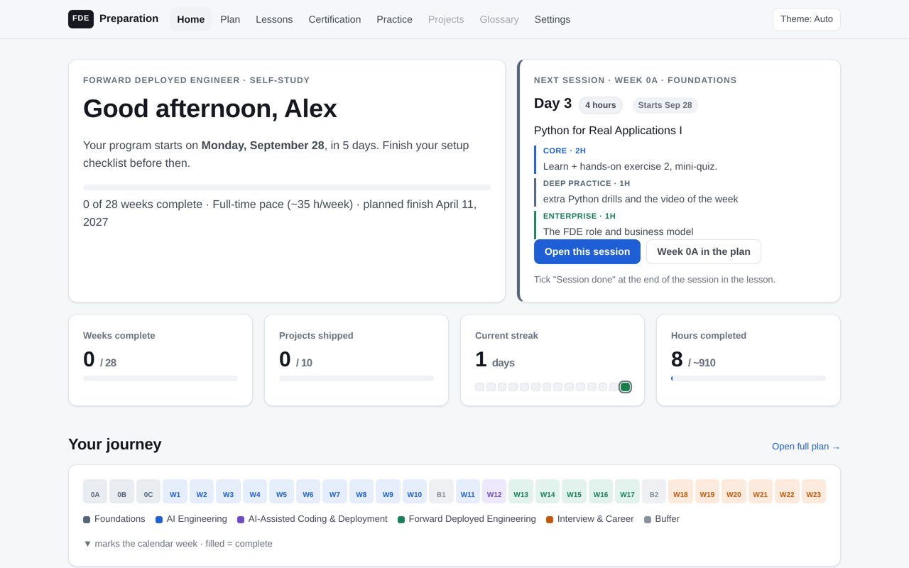
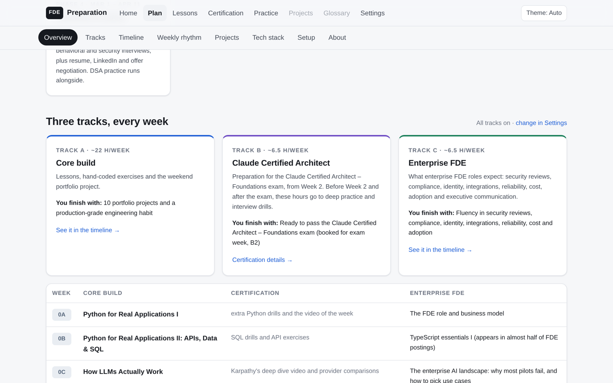
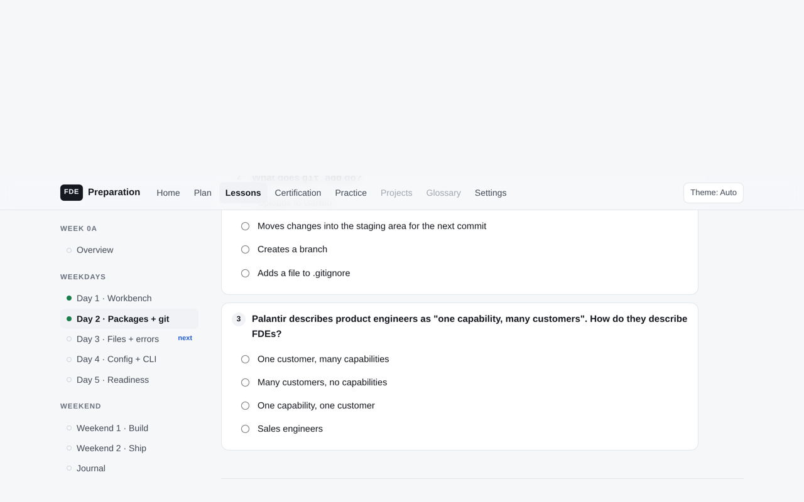
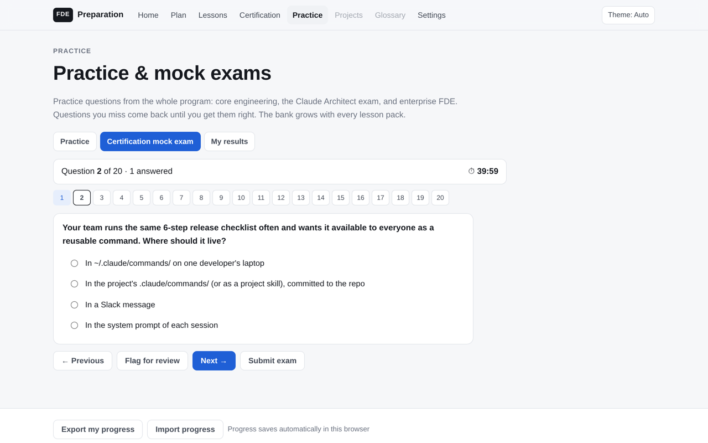
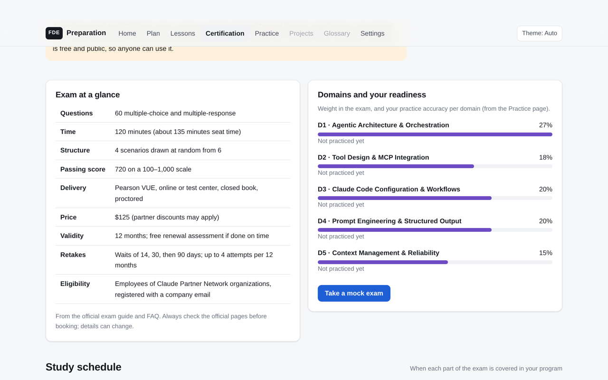
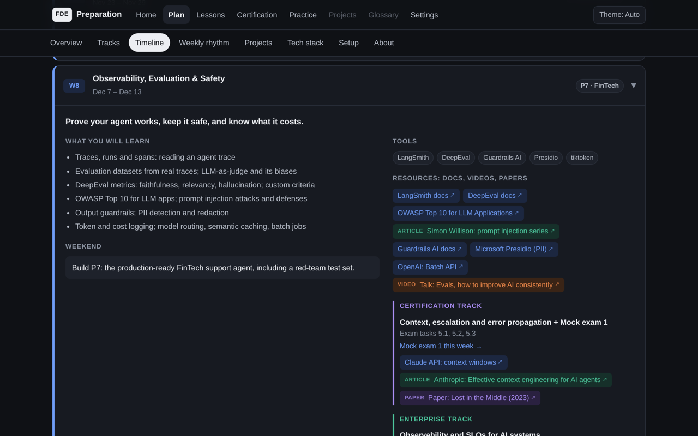

# From Zero to Forward Deployed Engineer

An open, self-paced, **28-week** program for becoming an **enterprise-ready Forward Deployed Engineer (FDE)**: the engineer who sits with a customer, scopes a real problem, and ships a production AI system into their environment.

It is a complete interactive learning platform that runs in your browser. It has day-by-day lessons, hand-coded exercises with stepped hints, readings linked to official docs and original papers, quizzes, timed certification mock exams, and progress tracking. It needs no accounts, has no tracking, and needs no build step.



---

## Why this exists

FDE roles at AI companies ask for an unusual mix of skills: production-grade agent engineering, **and** customer discovery, scoping, security reviews, enterprise integration and executive communication. Most courses teach one half. This program teaches both, through **10 portfolio projects** set in different industries, and adds structured preparation for the **Claude Certified Architect – Foundations** exam.

I'm working through the program myself, starting September 2026. My project repositories will be linked in the [progress table](#progress) as they ship.

---

## What you finish with

| | |
|---|---|
| **10 portfolio projects** | Each ships with a README, design decisions, measured evals, tests and a demo |
| **Claude Certified Architect prep** | All 30 exam tasks mapped to weeks, 3 timed mock exams, and a practice bank that grows every week |
| **Enterprise FDE knowledge** | Security questionnaires (SOC 2, ISO 27001/42001), HIPAA, GDPR, the EU AI Act, NIST AI RMF, SSO/SCIM, private networking, observability and SLOs, LLM cost control, adoption and change management |
| **Interview readiness** | AI system design, the decomposition / case round, AI pair-coding, behavioral and security interviews, and company-specific formats |

---

## Quick start

**Option 1: download and run locally**

```bash
git clone https://github.com/starskrime/from_zero_to_forward_deployed_engineer.git
cd from_zero_to_forward_deployed_engineer
bash start.sh          # macOS / Linux
# start.bat            # Windows: double-click it
```

The script starts a tiny local web server with Python 3 and opens the platform in your browser. On first launch it asks for your first name, start date and pace. **Everything stays in your browser**; use *Export my progress* to back it up.

**Option 2: GitHub Pages.** This repository is plain static HTML, so it can be served directly with GitHub Pages (Settings → Pages → deploy from the `main` branch).

---

## Program at a glance

| Phase | Weeks | Focus |
|---|---|---|
| **0 · Foundations** | 0A–0C | Project-grade Python, APIs, Pydantic, pytest, async, SQL; how LLMs actually work (tokens, cost, three providers) |
| **1 · AI Engineering** | W1–W11 | Agents from scratch, RAG, multi-agent systems, voice and vision, MCP and A2A, vertical agents, evals and safety, fine-tuning, AI capstone. **All code typed by hand.** |
| **2 · AI-Assisted Coding & Deployment** | W12 | Claude Code workflows, FastAPI, Docker, CI/CD, Kubernetes concepts |
| **3 · Forward Deployed Engineering** | W13–W17 | One continuous customer engagement: discovery → statement of work → build on AWS Bedrock AgentCore → access control → evals, incident drill, handover |
| **4 · Interview & Career** | W18–W23 | AI system design cases, decomposition rounds, AI pair-coding, behavioral and security interviews, resume, LinkedIn, offers |
| Buffers | B1, B2 | Catch-up; B2 is certification exam week |

### Three tracks, every week



| Track | Hours / week | What it covers |
|---|---|---|
| **A · Core build** | ~22 | Lessons, hand-coded exercises, the weekend portfolio project |
| **B · Claude Certified Architect** | ~6.5 | From Week 2: all five exam domains, the six exam scenarios, three mock exams. Before Week 2 and after the exam: deep practice and company-specific interview drills |
| **C · Enterprise FDE** | ~6.5 | One enterprise theme per week, plus TypeScript essentials |

### Choose your pace

The content is the same at every pace; only the calendar stretches. Optional tracks can be switched off.

| Pace | Weekdays | Weekend days | Per week | Finish (all tracks) |
|---|---|---|---|---|
| Full-time | 4h | 7.5h | ~35h | ~28 weeks |
| Intensive | 2h | 6h | ~22h | ~10 months |
| Steady | 1.5h | 4h | ~15.5h | longer; turn off optional tracks to shorten |
| Relaxed | 1h | 3h | ~11h | best with the core track only |

---

## The 10 portfolio projects

| # | Project | Domain | Built with |
|---|---|---|---|
| P1 | Mortgage Lead Qualifier Agent | Mortgage | OpenAI |
| P2 | SaaS IT-Support Knowledge Assistant (RAG) | High tech | OpenAI + open-source embeddings |
| P3 | Multi-Agent EV Road-Trip Planner | Auto | Claude via LangGraph |
| P4 | Voice & Vision Auto-Parts Ordering Assistant | Auto | OpenAI (speech + vision) |
| P5 | Home-Purchase Negotiation Simulator (MCP + A2A) | Real estate | Claude + MCP |
| P6 | SaaS Customer-Review Insights Dashboard | High tech | OpenAI |
| P7 | Production-Ready FinTech Support Agent | FinTech | Claude Agent SDK |
| P8 | Fine-Tuned Healthcare Q&A Model | Health | Open-source model (QLoRA) |
| P9 | AI Engineering Capstone | Your choice | Multi-provider |
| P10 | FDE Capstone: Claims or Prior-Authorization Copilot | Insurance / health | Claude Agent SDK on AWS Bedrock AgentCore |

Every project meets the same portfolio standard: **README · design decisions · evals with real numbers · passing tests · 2-minute demo · no secrets in git.**

---

## Inside the platform

| | |
|---|---|
|  |  |
| **Lessons**: sessions split by track, a coverage map ("nothing in the weekend project you haven't practiced"), stepped hints (concept → pseudocode → snippet → solution after you've tried), mini-quizzes, a weekly quiz with spaced review, and a journal you can download | **Practice & mock exams**: the whole-program question bank with filters, questions you missed come back, and timed mock exams weighted by the certification's domains with a per-domain score |
|  |  |
| **Certification page**: exam facts, domain weights with your readiness, all 30 exam tasks mapped to the week that teaches them, the six scenarios | **Plan**: the full 28-week timeline with filters and search; every week lists topics, tools, certification focus, enterprise theme, and labeled resources (docs, videos, papers, articles). Light and dark themes |

### Principles

1. **No surprises.** Every weekend project uses only what was taught and practiced earlier that week.
2. **Hands on first.** Through Week 11 learners type every line of project code; AI coding tools arrive in Week 12. (Configuring Claude Code for the certification is practiced separately.)
3. **Learn, do, check, every day.** A lesson or video, a hands-on exercise, and a quiz in every session.
4. **Primary sources.** Official documentation, original papers, engineering blogs and conference talks. Links are checked before a lesson is published.
5. **Portfolio standard.** Built to be read by hiring managers.

---

## Progress

| Week | Topic | Status | My work |
|---|---|---|---|
| 0A | Python for Real Applications I | Lesson published | — |
| 0B | APIs, Data & SQL | Lesson published | — |
| 0C | How LLMs Actually Work | In preparation | — |
| W1–W23 | See the Plan page | Published ahead of each week | — |

Lesson packs are published ahead of each week. Portfolio repositories will be linked here as they ship.

---

## Repository structure

```
├── index.html            Home dashboard (next session, streak, progress)
├── plan.html             28-week plan: tracks, timeline, projects, stack
├── lessons.html          Lesson index
├── lessons/              One page per program week (+ sample data files)
├── certification.html    Claude Certified Architect – Foundations prep
├── practice.html         Question bank and timed mock exams
├── settings.html         Name, start date, pace, tracks, backup / reset
├── assets/
│   ├── css/platform.css  Design tokens, light and dark themes
│   └── js/
│       ├── curriculum.js Core curriculum data (weeks, projects, resources)
│       ├── tracks.js     Certification and enterprise tracks, paces, sessions
│       ├── questions.js  Question bank (original questions)
│       ├── store.js      Progress saved in the browser (localStorage)
│       ├── ui.js         Header, onboarding, pace-aware calendar
│       ├── lesson.js     Hints, quizzes, journal, progress
│       └── home.js · plan.js · practice.js
├── docs/screenshots/
└── start.sh · start.bat  One-command local start
```

No frameworks, no dependencies, no build step. Plain HTML, CSS and JavaScript that will still open in ten years.

---

## Contributing

Issues and pull requests are welcome, especially:

- broken or outdated links (tools change quickly)
- corrections to lessons or quiz explanations
- new practice questions (original only; never real exam content)

## Notes

- This is an independent, community learning project. It is not affiliated with or endorsed by Anthropic, OpenAI, Google, AWS, Microsoft or any company whose tools or job postings are referenced.
- Practice and mock-exam questions are original, written from the public exam guide. They are **not** real exam items.
- Certification eligibility, price and format are set by the certification provider and can change; always check the official pages.

## License

- Platform code: [MIT](LICENSE)
- Lesson content: [CC BY 4.0](LICENSE-CONTENT)
- Linked third-party resources belong to their owners.
